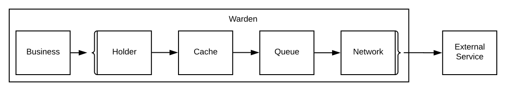

<p align="center"></p>

Warden is an outgoing request optimizer for creating fast and scalable applications. Warden is being used in [PuzzleJs](https://github.com/puzzle-js/puzzle-js) framework for gateway communication.

[](https://circleci.com/gh/puzzle-js/puzzle-warden/tree/master)   

## Features
- 📥  **Smart Caching** Caches requests by converting HTTP requests to smart key strings. ✅
- 🚧  **Request Holder** Stopping same request to be sent multiple times. ✅
- 🔌  **Support** Warden can be used with anything but it has out of the box support for [request](https://github.com/request/request). ✅
- 😎  **Easy Implementation** Warden can be easily implemented with a few lines of codes. ✅
- 🔁  **Request Retry** Requests will automatically be re-attempted on recoverable errors. 📝
- 📇  **Schema Parser** Uses provided schema for parsing json faster. 📝
- 🚥  **API Queue** Throttles API calls to protect target service. 📝
- 👻  **Request Shadowing** Copies a fraction of traffic to a new deployment for observation. 📝
- 🚉  **Reverse Proxy** It can be deployable as an external application which can serve as reverse proxy. 📝
- 📛  **Circuit Breaker** Immediately refuses new requests to provide time for the API to become healthy. 📝



## Getting started
- [Installing](#installing)
- [Quick Guide](#quick-guide)
- [Identifier](#identifier)
- [Registering Route](#registering-route)
- [Cache](#cache)

### Installing

Yarn
```
yarn add puzzle-warden
```
Npm
```
npm i puzzle-warden --save
```

### Quick Guide

#### 1.  Register Route
```js
const warden = require('puzzle-warden');
warden.register('test', {
  identifier: 'ty_{query.foo}_{cookie.bar}',
  cache: true,
  holder: true
});
```

#### 2. Send Request

##### Using Warden
```js
warden.request('test', {
  url: `https://postman-echo.com/get?foo=value`,
  headers: {
    cookie: `bar=value`
  },
  method: 'get',
  gzip: true,
  json: true
}, (err, response, data) => {
  console.log(data);
});
```

##### Using [Request](https://github.com/request/request) Module
```js
request({
  name: 'test',
  url: `https://postman-echo.com/get?foo=value`,
  headers: {
    cookie: `bar=value`
  },
  method: 'get',
  gzip: true,
  json: true
}, (err, response, data) => {
  console.log(data);
});
```
___

### Identifier

Warden uses identifiers to convert HTTP requests to unique keys. Using these keys it is able to implement cache, holder and other stuff.
Lets assume we want to send a GET request to `https://postman-echo.com/get?foo=value&bar=anothervalue`. And we want to cache responses based on query string `foo`.
We should use identifier `{query.foo}`. There are 5 types of identifier variables.

- `{url}` Url of the request
- `{cookie}` Cookie variable. You can use `{cookie.foo}` to make request unique by foo cookie value.
- `{headers}` Header variable. You can use `{headers.Authorization}` to make request unique by Authorization header
- `{query}` Query string variables. You can use `{query.foo}` to make request unique by query name.
- `{method}` HTTP method. GET, POST etc.

You can also use javascript to create custom identifiers.

- `{url.split('product-')[1]}` Works for link `/item/product-23`.

Identifiers can be chained like `{query.foo}_{cookie.bar}`.

Identifiers gets converted to keys for each request. Lets assume we have an identifier like `{query.foo}_{method}`
We use this identifier for GET request to `/path?foo=bar`. Then the unique key of this request will be `bar_GET`.

### Registering Route

You can simply register a route providing an identifier and module configurations. Please see [Identifier](#Identifier)

```js
warden.register('test', {
  identifier: 'ty_{query.foo}_{cookie.bar}',
  cache: true,
  holder: true
});
```

### Cache

